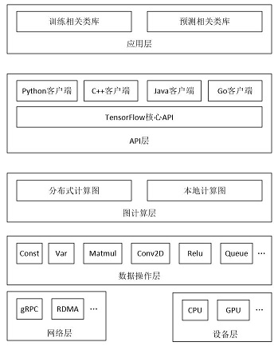

### 依赖工具
1. 自动化构建工具[Bazel](https://www.bazel.build/)
2. 脚本语言调用c/cpp库工具[Swig](http://www.swig.org/)
3. 矩阵处理工具[Eigen](http://eigen.tuxfamily.org)
4. GPU加速计算库Nvidia-cuBLAS
5. 结构化数据存储格式[protobuf](https://github.com/google/protobuf)

### 系统架构

### 设计理念
 - 将图的定义和图的运行完全分开。
> TensorFlow完全采用符号式编程，而其他深度学习框架中Torch是典型的命令式编程；Caffe、MXNet采用了两种编程模式混合的方法。
 - 涉及到的运算都要放在图中，而图的运行只发生在会话（session）中。

### 编程模型
TensorFlow是基于数据流图做计算的，看一下其中的各个要素。
 - 边
 > Tensorflow的边有两种连接关系：数据依赖和控制依赖。控制依赖的边上没有数据流过，但源节点必须在目的节点开始执行前完成执行。
 - 节点
 > 又称算子，它代表一个操作OP，一般用来表示施加的数学运算。与操作相关的代码位于/tensorflow/python/ops/目录下。
 - 图
 - 会话
 - 设备
 > 设备(device)是指一块可以用来运算并且拥有地址空间的硬件，如CPU/ GPU。Tensorflow为了实现分布式执行操作，充分利用计算资源，可以明确指定操作在哪个设备上执行。
 - 变量
 - 内核
 > 内核(kernel)是能够运行在特定设备device上的一种对操作的实现。因此，同一个操作可能会对应多个内核。

### 目录结构
 - c/
 - cc/ - 采用C++进行训练的样例
 - compiler/
 - [contrib/](./contrib/) - 将常用功能封装在一起的高级API
 - core/ - C++实现的主要目录
	- api_def
	- common_runtime - 公共运行库
	- debug                        
	- distributed_runtime - 分布式执行模块，包含grpc session/ grpc worker/ grpc master等    
	- example
		- [mnist](./models/mnist.md)                         
	- framework - 基础功能模块                     
	- graph - DAG图相关
	- grappler
	- kernels - 核心Op在CPU、CUDA内核上的实现，如[matmul, conv2d, argmax, batch_norm]等
 	- lib - 基础公共库
    	- gtl - google template library, 包含array_slice/ iterator_range/ inlined_vector/ map_util/ stl_util等基础库
 	- ops - 基本op操作，如array_ops/ math_ops/ image_ops/ function_ops/ random_ops/ io_ops/ control_flow_ops/ data_flow_ops；以及定义了op梯度计算方式：array_grad/ math_grad/ functional_grad/ nn_grad/ random_grad
 	- platform - 操作系统实现相关文件，如设备内存分配
 	- profiler
 	- protobuf - 均为.proto文件，用于数据传输时的结构序列化
 	- public - 公共头文件，用于外部接口调用的API定义，主要是session.h/ tensor_c_api.h
 	- user_ops - 用户自定义op           
 	- util
 - examples/ - 各种示例
 - g3doc/ - 针对C++、python版本的代码文档
 - go/
 - java/
 - python/ - python实现的主要目录
 - stream_executor/ - 流处理
	> StreamExecutor is a unified wrapper around the CUDA and OpenCL host-side programming models (runtimes)
 - tensorboard/ - App、Web支持，以及脚本支持